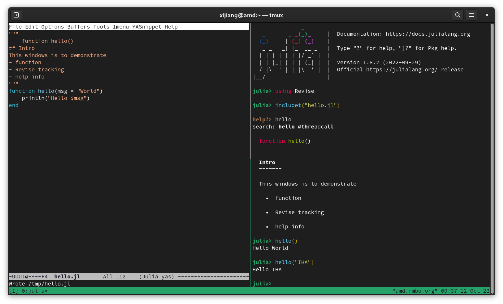

## Tools you needs
- Julia
  - `winget install julia -s msstore`, in Windows CMD.
  - `sudo dnf install julia`, with `dnf` pkg managment.  Replace with `apt` in Ubuntu.
  - Download from https://julialang.org
  - With `Revise` package installed
- Set 1
  - VS Code, with extension
	- `julia`, for code editing
	- `remote-ssh`, to access WSL or remote Linux servers
	
- Set 2
  - A terminal
  - Tmux
  - Emacs, Vim (steep learning curves), or Nano (very simple and fool-proof)
  - `Revise` package for Julia 

- Set 3: Jupyter (**Ju**lia **pyt**hon, and **R**) lab

## VS code
- available in Microsoft store
- instructions
  - e.g., https://code.visualstudio.com/docs/languages/julia
  


## Tmux-emacs-julia-revise setup (reference only)
```bash
sudo apt install tmux # for WSL if necessary
mkdir -p ~/.julia/config
cd ~/.julia/config
echo using Revise >> startup.jl
cd ~/julia-prj # if you are working there
tmux
<ctrl>+b % # to split a pane left and right
# <ctrl>+b " to split a pane up and down
# <ctrl>+b <arrow keys> to navigate panes
```

## Some Emacs (reference only)
- Insert below into the head of `~/.emacs`
```lisp
(setq gnutls-algorithm-priority "NORMAL:-VERS-TLS1.3")

(require 'package)
(add-to-list 'package-archives '("melpa" . "http://melpa.org/packages/") t)
;; Comment/uncomment this line to enable MELPA Stable if desired.  See `package-archive-priorities`
;; and `package-pinned-packages`. Most users will not need or want to do this.
;;(add-to-list 'package-archives '("melpa-stable" . "https://stable.melpa.org/packages/") t)
(package-initialize)
(yas-global-mode 1)
```
- Then you can add emacs package: `julia-mode`, `markdown-mode`, `yasnippet-snippets`

## Hello world!
- In lower right pane run julia
- In left pane edit hello.jl




## Jupyter-lab
```bash
pip install --user jupyterlab
julia  # to enter julia REPL
] # to enter package mode
add IJulia
# backspace to return to REPL
using IJulia
jupyterlab()
```

## If jupyter doesn't appear
```bash
jupyter-server list
```

- Open a browser, and view https://localhost:8000
- Copy and paste the link address with token to a browser
